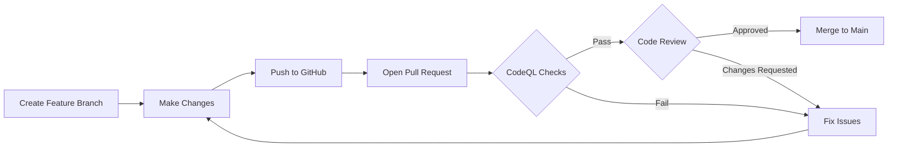

# Quick Start: Enable Branch Protection (5 Minutes)

## 🎯 Goal
Lock down your `main` branch to require CodeQL checks and PR reviews before any code can be merged.

---

## ⚡ Fast Setup (Copy-Paste Checklist)

### Step 1: Navigate to Settings
```
https://github.com/apexsalesai/apexsalesai-next/settings/branches
```

### Step 2: Click "Add branch protection rule"

### Step 3: Configure Protection

**Branch name pattern:**
```
main
```

**Check these boxes:**

#### ✅ Require a pull request before merging
- [x] Require approvals: **1**
- [x] Dismiss stale pull request approvals when new commits are pushed

#### ✅ Require status checks to pass before merging
- [x] Require branches to be up to date before merging
- Search and select these checks:
  - `Analyze (javascript)`
  - `Analyze (typescript)`

#### ✅ Require conversation resolution before merging

#### ✅ Do not allow bypassing the above settings
- [x] Include administrators

#### ✅ Restrict who can push to matching branches
- Leave empty (all changes via PR only)

#### ❌ Allow force pushes
- Leave **unchecked**

#### ❌ Allow deletions
- Leave **unchecked**

### Step 4: Click "Create" or "Save changes"

---

## ✅ Verification Test

1. Create a test branch:
   ```bash
   git checkout -b test/branch-protection
   echo "test" >> README.md
   git add README.md
   git commit -m "test: verify branch protection"
   git push origin test/branch-protection
   ```

2. Open a PR to `main` on GitHub

3. Try to merge immediately → **Should be blocked** ✅

4. Wait for CodeQL checks to pass → **Merge button enables** ✅

5. Close and delete the test PR

---

## 🚨 What This Prevents

- ❌ Direct commits to `main`
- ❌ Merging without code review
- ❌ Merging with failing security checks
- ❌ Force-pushing to rewrite history
- ❌ Accidental branch deletion

---

## 📊 Expected Workflow After Setup



---

## 🔗 Next Steps

After enabling branch protection:

1. **Merge your current feature branch** to `main` (before protection applies)
2. **Test the protection** with a dummy PR
3. **Train your team** on the new workflow
4. **Review** `docs/BRANCH_PROTECTION_SETUP.md` for advanced options

---

## 💡 Pro Tips

- **Hotfixes:** Create `hotfix/*` branches and fast-track reviews
- **Dependabot:** Auto-approve low-risk dependency updates
- **Admins:** Even admins should follow the rules (builds trust)
- **Status Checks:** Add more checks as your CI/CD grows

---

## 🆘 Troubleshooting

**Q: I can't find the CodeQL checks to select**  
**A:** Wait for the first CodeQL workflow run to complete, then they'll appear in the dropdown.

**Q: Can I bypass protection in an emergency?**  
**A:** Yes, but document why. Settings → Branches → Edit rule → Temporarily disable specific requirement.

**Q: What if CodeQL fails on my PR?**  
**A:** Click "Details" on the failed check to see the security issues, fix them, and push again.

---

**Setup Time:** ~5 minutes  
**Impact:** Immediate security improvement  
**Reversible:** Yes (can disable anytime)
